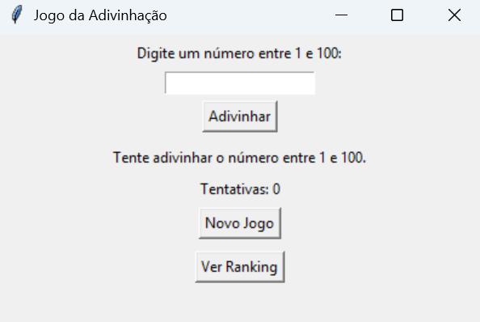

# projectInterface

# 🎮 Jogo da Adivinhação (Python + Tkinter)

Um jogo simples com interface gráfica onde o jogador tenta adivinhar um número aleatório entre 1 e 100. Desenvolvido em Python usando o módulo `tkinter`, com suporte a ranking local.

---

## 🖼️ Interface

- Interface gráfica com campo de entrada, botões e mensagens
- Palpites com feedback visual ("Muito alto", "Muito baixo", "Acertou!")
- Ranking dos 10 melhores jogadores com menos tentativas

---

## 🧠 Funcionalidades

✅ Geração de número aleatório  
✅ Nome do jogador no início de cada jogo  
✅ Contador de tentativas  
✅ Ranking salvo em arquivo (`ranking.txt`)  
✅ Ranking ordenado pelos melhores resultados  
✅ Botão para jogar novamente e mudar de jogador

---

## 🛠️ Tecnologias

- Python 3.x
- Tkinter (interface gráfica)
- `random` (para gerar número secreto)
- `simpledialog` e `messagebox` (diálogos gráficos)

---

## ▶️ Como Executar

1. Certifique-se de ter o Python 3 instalado.
2. Salve o arquivo como `jogo_gui_ranking.py`.
3. Execute no terminal:

```bash
python jogo_gui_ranking.py


 O tkinter já vem instalado com o Python na maioria dos sistemas. Se não funcionar, instale com:
sudo apt install python3-tk (Linux) ou use o instalador completo no Windows/macOS.

📁 Ranking
Os resultados são salvos no arquivo ranking.txt no mesmo diretório do jogo.

O ranking mostra os 10 jogadores com menos tentativas.
João - 4 tentativas
Ana - 5 tentativas
Carlos - 6 tentativas


🚀 Próximas melhorias (sugestões)
Adicionar níveis de dificuldade (fácil, médio, difícil)

Limitar número máximo de tentativas

Melhorar o layout com ttk ou tkinter.ttk

Exibir ranking em uma tabela mais elegante

Salvar os dados em .json para mais contr

#TELA DE PARA INSERIR NOME
📷 

#INTERFACE
📷

📷


